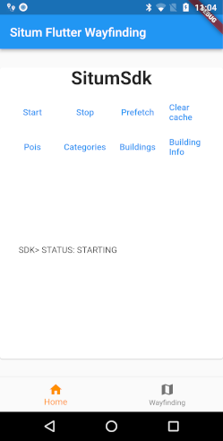
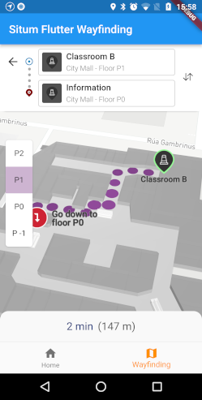

<p align="center"> 
<h1 align="center">Situm Flutter Wayfinding Example</h1>
</p>

<div align="center" style="text-align:center">

A sample Flutter application to start learning the power of [Situm's Flutter Wayfinding Plugin](../README.md).

</div>

<div align="center" style="text-align:center">

[](https://opensource.org/licenses/MIT)
[](https://pub.dev/packages/situm_flutter_wayfinding)
[](https://flutter.dev/)

</div>

## What's in here

This folder contains the necessary source code for an example application using the **SitumWayfinding plugin**.

<div align="center" style="display: flex;">
    
    
</div>

## How to run the app

### Step 1: Install the dependencies

The first step is to download this repo:

```bash
git clone https://github.com/situmtech/flutter-wayfinding.git
```

And then install the plugin dependencies alongside the `example` app as follows:

```bash
cd flutter-wayfinding/example
flutter pub get
```

#### iOS only

Run `pod install` or `pod update` from the `example/ios` folder to bring the dependencies to your project.

Also check out the project [code signing](https://developer.apple.com/support/code-signing/) before you run the example.

### Step 2: Set up your Situm credentials

Your credentials must be stored inside a file named `config.dart`. This example provides you with a template on `lib/config.dart.example`:

```dart
const situmUser = "YOUR-SITUM-USER";
const situmApiKey = "YOUR-SITUM-API-KEY";
const buildingIdentifier = "YOUR-SITUM-BUILDING-IDENTIFIER";
```

### Step 3: Run the app <a name="runapplication"></a>

From the `example` folder, execute the following command which works on both Android and iOS devices:

```bash
flutter run
```

You can also run the app from your IDE:

- On Android: open `example/android/` with Android Studio.
- On iOS: open `example/ios/Runner.xcworkspace` with XCode.

## Documentation

More information on how to use the official Flutter plugin and the set of APIs, the functions, parameters and results each function accepts and provides can be found in our [SDK API Reference](https://pub.dev/documentation/situm_flutter_wayfinding/latest/situm_flutter_sdk/situm_flutter_sdk-library.html) and [Wayfinding API Reference](https://pub.dev/documentation/situm_flutter_wayfinding/latest/situm_flutter_wayfinding/situm_flutter_wayfinding-library.html).

### Examples

In case you want to learn how to use our plugin, you may want to take a look at our code samples of the basics functionalities:

1. [**Basic SDK and WYF functionality**](./lib/main.dart): showcases how to initialize the Situm SDK (refer to the [flutter sdk quickstart guide](https://situm.com/docs/a-basic-flutter-app/) for more information) and how to use some basic features like positioning and obtaining the information of a given building. It also shows how to use the Situm Wayfinding module (refer to the [flutter wayfinding quickstart guide](https://situm.com/docs/flutter-quickstart-guide/) for more information).

## Versioning

We use [SemVer](http://semver.org/) for versioning.

Please refer to [CHANGELOG.md](../CHANGELOG.md) for a list of notables changes for each version of the library.

You can also see the [tags on this repository](https://github.com/situmtech/flutter-wayfinding/tags).

## Submitting Contributions

You will need to sign a Contributor License Agreement (CLA) before making a submission. [Learn more here.](https://situm.com/contributions/)

## License

This project is licensed under the MIT - see the [LICENSE](../LICENSE) file for details.

## More information

More info is available at our [Developers Page](https://situm.com/docs/01-introduction/).

## Support information

For any question or bug report, please send an email to [support@situm.es](mailto:support@situm.es)
